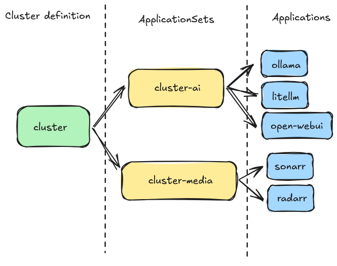

# OpenShift Argo CD Cluster Deployment Model

This repository implements an Argo CD-based GitOps deployment model for OpenShift/OKD clusters. It provides a structured approach to deploying and managing applications across different functional domains through a simplified template-based system.

## Architecture Overview

The deployment model follows a two-tier architecture:

1. **Cluster Definition** (`/cluster`) - Bootstrap configuration and role templates
2. **Charts** (`/charts`) - Individual Helm charts for each application organized by functional groups



## Repository Structure

```text
├── cluster/                   # Cluster bootstrap configuration
│   ├── Chart.yaml
│   ├── values.yaml            # Cluster-wide configuration
│   └── templates/
│       ├── media.yaml         # Media applications ApplicationSet
│       ├── ai.yaml            # AI/ML applications ApplicationSet
│       └── utilities.yaml     # Utilities ApplicationSet
└── charts/                    # Individual application Helm charts
    ├── ai/
    │   ├── litellm/           # LiteLLM proxy for LLM management
    │   ├── ollama/            # Local LLM runtime
    │   └── open-webui/        # Web UI for LLMs
    ├── media/
    │   ├── bazarr/            # Subtitle management
    │   ├── gaps/              # Media gap detection
    │   └── kapowarr/          # Comic book management
    └── utilities/
        └── excalidraw/        # Whiteboard tool
```

## How It Works

### 1. Cluster Bootstrap

The cluster bootstrap process starts by deploying the main cluster chart, which creates Argo CD ApplicationSets for different functional domains.

**Key file**: `cluster/values.yaml`

- Contains cluster-wide configuration values
- All applications inherit configuration through Helm value passthrough

### 2. Template-Based Application Management

Each functional domain (AI/ML, Media, etc.) is managed by an ApplicationSet template in `cluster/templates/`:

- **media.yaml**: ApplicationSet that manages media applications
- **ai.yaml**: ApplicationSet that manages AI/ML applications
- **utilities.yaml**: ApplicationSet that manages utility applications

Each ApplicationSet template defines which applications to deploy from the corresponding `/charts` subdirectory.

### 3. Application Deployment

Each application in the `/charts` directory is a complete Helm chart with:

- **Kubernetes manifests**: StatefulSets, Services, Routes, etc.
- **OpenShift-specific resources**: SecurityContextConstraints, Routes
- **Integration features**: Console links, custom Application CRDs
- **Storage management**: PVCs with configurable storage classes

## Available Applications

### AI/ML Role

- **LiteLLM**: Unified API proxy for managing multiple LLM providers
- **Ollama**: Local large language model runtime
- **Open WebUI**: User-friendly web interface for interacting with LLMs

### Media Role

- **Bazarr**: Subtitle management for media files
- **Gaps**: Tool for finding missing movies in series

### Utilities Role

- **Excalidraw**: Whiteboard tool

## Configuration

### Cluster Configuration

Override parameters as needed during deployment:

```yaml
apiVersion: argoproj.io/v1alpha1
kind: Application
metadata:
  name: cluster
  namespace: openshift-gitops
spec:
  destination:
    namespace: openshift-gitops
    server: "https://kubernetes.default.svc"
  project: default
  source:
    helm:
      parameters:
        - name: config.cluster.admin_email
          value: magnus@ullberg.us
        - name: config.cluster.name
          value: openshift
        - name: config.cluster.timezone
          value: America/New_York
        - name: config.cluster.top_level_domain
          value: ullberg.local
        - name: spec.source.repoURL
          value: "https://github.com/ullbergm/openshift/"
        - name: spec.source.targetRevision
          value: v2
        - name: config.cluster.storage.config.storageClassName
          value: "local-path"
    path: cluster
    repoURL: "https://github.com/ullbergm/openshift/"
    targetRevision: v2
```

## OpenShift Integration Features

### Networking

- **Routes**: Automatic HTTPS routes with edge termination
- **Services**: ClusterIP services for internal communication

### UI Integration

- **Console Links**: Applications appear in OpenShift console menus
- **Cluster Homepage**: Startpunkt is used as the cluster homepage and every application is listed there

### Storage

- **Flexible storage**: Uses the default cluster CSI driver unless a different one is specified
- **NFS integration**: Shared storage for media applications via NFS
- **Backup annotations**: Kasten backup integration

## Customization

### Adding a New Application

1. Create a new Helm chart in the appropriate `/charts` subdirectory (e.g., `/charts/media/myapp/`)
2. Add the application name to the corresponding ApplicationSet template in `/cluster/templates/`
3. The application will be automatically deployed by Argo CD

### Adding a New Functional Group

1. Create a new ApplicationSet template in `/cluster/templates/` (e.g., `monitoring.yaml`)
2. Define the list of applications for that functional group in the template
3. Create the corresponding subdirectory in `/charts/` (e.g., `/charts/monitoring/`)

## Maintenance

- **Updates**: Renovate keeps the versions up to date

## Developer notes

- Validations: run with Task. The CI pipeline runs `validate:all` (ADR checks and Helm template/lint) on pushes and PRs.
- Pre-commit: local hooks run ADR validation and Helm validation/lint. Install pre-commit and ensure `helm` and `task` are available in your PATH.
